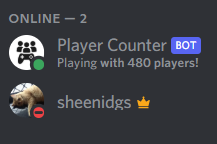

# Preview

# Instruction

1. Run `npm install`

2. Create `.env` file from `.env.sample`.

3. Configure `.env`.

4. Run `npm run build`.

5. Run `npm start`.

# Configuration

| Key                   | Value        | Description                                                  |
|-----------------------|--------------|--------------------------------------------------------------|
| `APP_LOOKUP_INTERVAL` | `5000`       | Interval app to re-check the player's number (in milisecond) |
| `SAMP_ADDRESS`        | `127.0.0.1`  | SA-MP Host                                                   |
| `SAMP_PORT`           | `7777`       | SA-MP Port                                                   |
| `SAMP_LOOKUP_TIMEOUT` | `3000`       | Wait to timeout if not responding (in milisecond)            |
| `DISCORD_BOT_TOKEN`   | `your_token` | Your bot token                                               |
